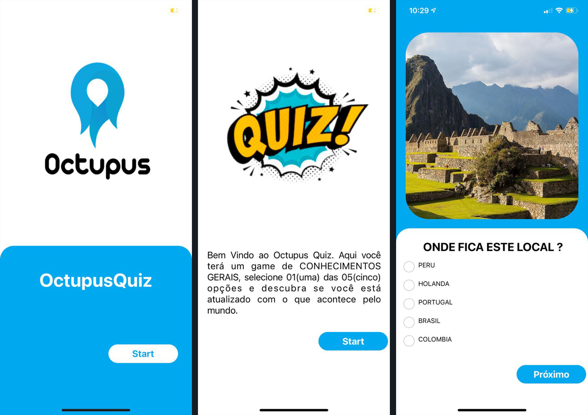

<h1 align="center"> 
	OctupusQuiz
</h1>

<h1 align="center">
    
    
</h1>

<h4 align="center"> 
	🚧  OctupusQuiz 🏫 100% Iniciando Desafios 🚧
</h4>

## 💻 Sobre o projeto

🎇 OctupusQUiz -É UM APP DIVERTIDO ONDE VOCÊ TEM A OPORTUNIDADE DE TESTAR SEUS CONHECIMENTOS GERAIS.

Projeto desenvolvido para [Octupus](https://Octupus.me/).

## 🛠 Desafio

Adicione um cronômetro de 10 minutos. Se o usuário não terminar dentro desse tempo finalizar o quiz e ir para os resultados - OK

Utilizar styled-components para escrever a estilização. 

Gerenciar o estado da aplicação com Redux.

Configurar prettier e eslint no projeto - OK

## 🛠 Tecnologias
As seguintes Lib's foram usadas na construção do projeto:
   
    axios
    expo
    expo-status-bar
    react
    react-dom
    react-native
    react-native-community/checkbox
    react-native-community/masked-view
    react-navigation/native
    react-navigation/stack
    react-native-animatable
    react-native-elements
    react-native-gesture-handler
    react-native-multiple-choice-picker
    react-native-picker-select
    react-native-radio-button
    react-native-reanimated
    react-native-redash
    react-native-safe-area-context
    react-native-screens
    react-native-simple-radio-button
    react-native-svg
    react-native-web
    react-navigation"
    react-navigation-drawer
    react-navigation-stack
    react-navigation-tabs
    react-redux

## 📝 Licença

Este projeto esta sobe a licença [MIT](./LICENSE.md).

 🚀 Desenvolvido por Allan Oliveira 🚀 

